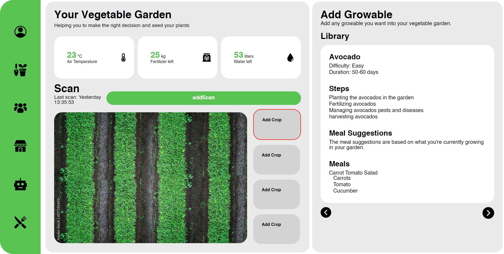
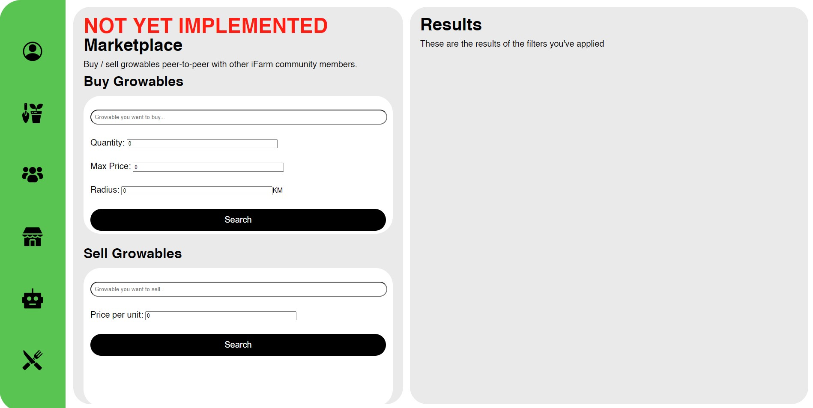

# iFarm client
 Sonar:

## Home Page
Welcome to our application iFarm! the homepage of our application is your account page. Here you can easily manage your subscription and explore the other subscriptions we have to offer. Here, you will also find some information about your garden. Thanks for being a part of our application - enjoy!

---

If you do not have a garden yet, the first page you will be directed to is the followoing page where you must enter a garden name first. Once you have done this, you can begin using iFarm and grow as many plants you'd like!

---

## Garden Page
Navigate to our Garden page to view general information about your garden, such as air temperature, amount of fertilizer, and amount of water remaining. You'll also see a top-view scan of your garden, with four boxes for adding crops. 

### Add Crop To Garden
To add a crop, click one of the "add crop" boxes. You'll then be directed to the library (as seen in the picture below).  You then click on any crop you want to add to your garden to go to the next step! In this example we will add some advocados to the garden.

#### Info About The Crop
On this page, you will find information about the crop you selected in the previous step, including difficulty, duration, steps for planting, and meal suggestions. You can navigate back and forth using the arrow buttons.

#### Select Zone
On this page, you can choose the area of your garden for your plant. After you select the zone, we can provide a recommendation for the amount of fertilizer you may need (this is optional: we're just trying to help!). You can finally add the crop by clicking on the last arrow button!

### Crop Statistics
Once you have completed the final step and added the crop to your garden, it will automatically be added. You can then view the statistics and information about the plant, such as a graph of the expected yield, growth, health, last scan time, and any warnings associated with the plant.

#### Add Scan

At this point, you have not gathered any data because you haven't scanned the plant. To do so, click your plant and select the "Add Scan" button. Using your Martian device, initiate the scan. 

Once completed the scan, you will have the latest and most accurate information about your plant.

---

## Community Page

As a user on the Community page, you can add posts, view others' posts, like posts, comment on posts, and like each other's comments. This functionality is available for all Community posts. Push notifications will alert you of any activity on your posts.

---

## Marketplace Page

This page is designed to facilitate the sale and purchase of crops. Unfortunately, only the HTML and CSS have been implemented at this point. You would be able to select the desired crop, set the quantity, specify a maximum price, and the maximum distance you are willing to travel to purchase it. Once you have set your filters, you can submit them and the page will generate a map showing the available sellers who meet your criteria.

---

## Robots Page
Navigate to our robot page to view general information about your robots in your garden, such as current workload and the amount of robots you have at this moment. You'll also see a top-view scan of your garden, with four boxes for adding robots. 

To add a robot to your garden, simply click one of the "Add Robot" boxes. You'll then see a QR code; scan it with your robot, give it a name, and decide what you'd like it to do. Once you've done that, click the "Setup" button and the robot will be added to your garden. To add a robot you need to be a PremiumExcel subscriber.

### Robot Statistics Page
Once the robot is added, you can click on it to view its information, including a live POV from the robot's camera, current power, operating sols, and robot assignment. Warnings will appear below if something is amiss.

---

## Meals Page
This food page provides lots of information about the most delicious meals you can imagine. On the left side of your screen, you can view the meal categories (see picture). You can select one and its dishes will show up on the right side of the screen. There is also a searchbar where you can look up a specific dish within a category. Below the selection, you can usually see the ingredients, but unfortunately, the API (https://www.themealdb.com/api.php) doesn't include ingredients per dish. Otherwise these would be inserted!

---

## Known Bugs
- If you click the "scan now" buton multiple times before server respnods, it will throw an error. 
- When adding a crop, if you click the final arrow button to add the plant multiple times, it will add the plant more than once.
- in the account page, if you want to change subscription it will sometimes not work on the first click.
