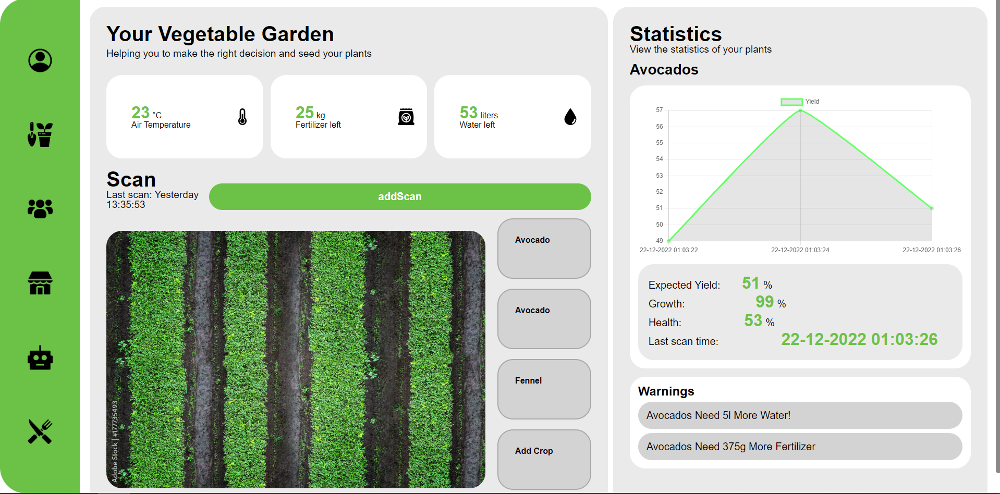
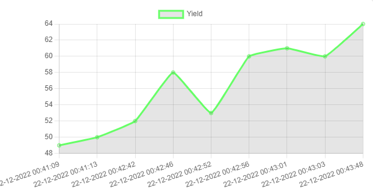
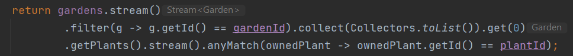
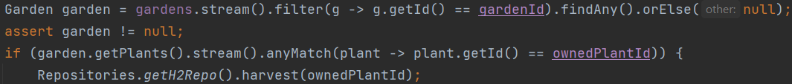
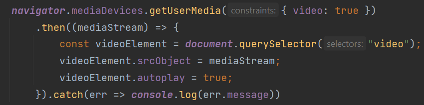

# Introduction to Ifarm 
We are the intergalactic farmers cooperation and this is our application which guides people in farming their own crops at home. Our application will tell users how to grow their plants and give very specific advice, or even automate the farming with robots.  

## SonarQube
### in sonarQube you can see the quality of our code
-  **Client**:

-  **Server**:

# Technologies implemented
## Mandatory requirements
- **Web client** is written in css (sass), html and javascript
- **Server** is Java with the vert.x library, no other libraries are used. 
- **Web Api** consists of endpoints and websockets. 
- **H2 database** Most of the data is held in a h2 database.

## Customizable requirements
### Class-taught
- **Real time communication**: Websockets are used for liking a post or comment. The client side code for this can be found in "src/assets/js/pages/community/eventBus.js". The server side code for this is in "src/main/java/be.howest.ti.mars/logic/socket_handlers".
- **Graphs: chart.js**: A chart showing the yield over time is shown in the gardens page. The code for this graph can be found at "src/assets/js/pages/garden/chart.js". 

## Self-study
- **FullScreen API**: The page goes into fullscreen when scanning a page, code at "src/assets/js/pages/garden/scan.js";
- **CSS animations**: Css animations are implemented over the entire ui. These animations are stored at "src/assets/css/general/scss".
- **higher order functions**: Higher order functions have been used in these places.
    * gardenContainsPlant in DefaultMarsController.java   
    * harvest in DefaultMarsController.java   
- **SASS features**: All styling is done in sass files. All these files are in "src/assets/css";
- **MediaStream imageCapture API**: This api has been used to open your camera to make a scan. This code is at "src/assets/js/pages/garden/scan.js" in the function openScanner.   